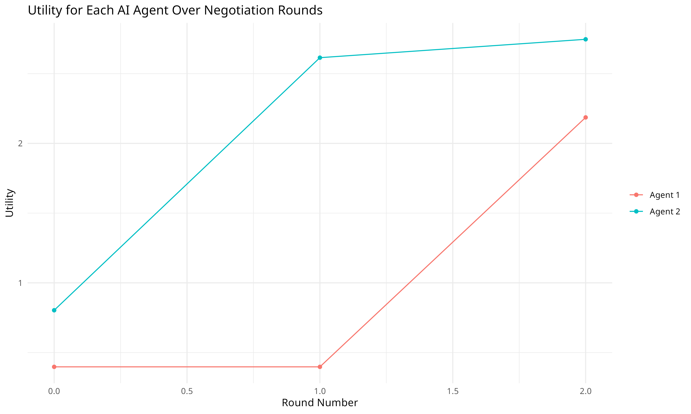

# AI Utility Maximization via Barter in a Two-good Exchange Economy

```
######################################
# AI Utility Maximization via Barter #
#    Under Bounded Rationality       #
# https://posocap.com                #
# https://github.com/posocap         #
# First version: Fall 2023           #
# Last updated: June 2025            #
######################################
```

## Overview

This program creates an arbitrary number of AI agents that negotiate trades with one another to improve their own utility, which refers to their overall well-being (happiness, productivity, etc.). In economic terms, this process is known as "utility maximization." 

The experiment accompanies a [Substack article](https://posocap.com) and serves several purposes. Economists have demonstrated that bartering can lead to more efficient outcomes, which has important theoretical implications. These concepts are discussed in the article and will be explored in greater detail (and with more code) in future installments of this series.

This project is informative as to the current state of AI in terms of practical information management--all the more so because some AI models performed the task effectively, while others did not. Finally, it illustrates the role of rationality for both human and artificial agents.

## How to Run It

Obtain an API key from https://platform.openai.com and store it in an environment variable called `OPENAI_API_KEY`. Clone this repo or download the .zip using the green button on the top-right of this screen. For example:

```bash
   git clone https://github.com/posocap/ai_barter_experiment.git
   cd ai_barter_experiment
```

Run with R or in an IDE (e.g., RStudio):

```r
    source("main_script.R") 
```



## Technical Features

This project makes use of a custom API response schema, utilizing OpenAI's semi-new "structured output" functionality.

Supports all current OpenAI conversation models. Tested with:

  - gpt-4o
  - gpt-4o-mini
  - o3-mini
  - o4-mini

## Economic Features

  - Cobb-Douglas utility, without the constrain that parameters sum to unity.
  - Bounded rationality courtesy of ChatGPT's poor math and information management capabilities (which are much better with the reasoning models).
  - Flexible information sharing.
  
## Authorship

Created by PosoCap.com. The original program was created without the aid of AI, mostly because it's not great with R, but the update applying the new structured output feature of OpenAI's API used generative AI to help verify that the errors in math were ChatGPT's, not ours, as well as to quickly scaffold the plot's code. GitHub Copilot was used to verified that there were no bugs in the logic and found none. Feel free to fork the code. Please link to this repo and https://posocap.com.